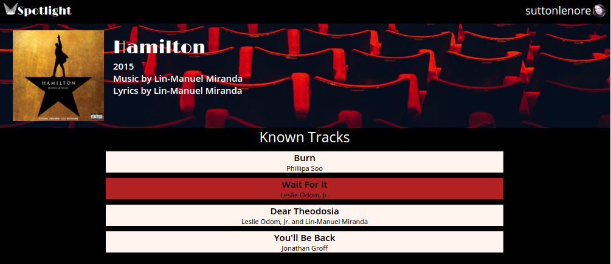
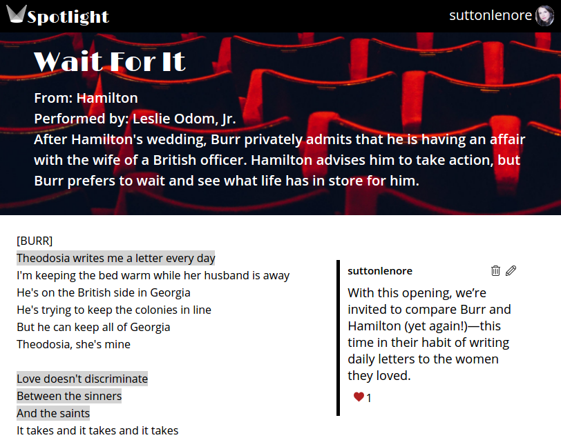

# Spotlight

[Spotlight Live][heroku]

[heroku]: https://spotlightbg.herokuapp.com

Spotlight is a full-stack web application inspired by Genius.  It utilizes Ruby on Rails on the backend, a PostgreSQL database, and React.js with a Redux architectural framework on the frontend.  

## Features & Implementation

### Profile

  Upon log in, the store fetches user data from the user, annotations, tracks, and comments tables. A logged in user has access to the `Profile` component, which lists counts of their contributions and a drop-down to see an index of all of the tracks, annotations, and comments they have added to the database, along with links to the tracks.

### Album Rendering

  Albums are stores in one table of the database, which contains columns for `id`, `title`, `image_url`, `year`, `composer`, and `lyricist`. Upon entering the root route, an API call is made to the database which gathers basic information for each album. This information is held in the `AlbumStore`. Users cannot add or edit Albums.

  Albums are rendered in two different components: the `AlbumIndex` component, which shows the image for each album as a link to the album show page, and the `AlbumShow` components, which show all information for the album along with a list of the tracks belonging to the album and a form to add a new track. These two components are never rendered at once.

  The list of tracks in each album is stored within the albums slice of state as it only contains the `id`, `title`, and `vocalists` for display and navigation purposes. The UI of the `AlbumShow` was taken from the profile page of Genius:

  

### Tracks

  On the database side, the tracks are stored in one table in the database, which contains columns for `id`, `user_id`, `album_id`, `title`, `lyrics`, `context`, `vocalists`, and `updated_at`.

  Once a user clicks on a track from the track index of the `AlbumShow` component or from their own `Profile` component if logged in, an API call is made to the database which joins the annotations and comments tables to the tracks tables on `track_id` and filters by the current track's id. The upvotes table is joined to the annotations table on `annotation_id`. and they move to the `Track` component.

  The React component structure for tracks has a few sub-components. Lyrics and other track information are stored in the top-level and displayed directly from the `Track` presentational component. The `CommentIndex` are rendered underneath the lyrics and apply to the entire track. If a user is logged in, a `CommentForm` is rendered above the list of comments. The `AnnotationShow`, `AnnotationForm`, and `AnnotationEdit` components render next to the line that they annotate, with the form only available to signed in users and the edit form only available to the owner of the annotation.

  Each line of the lyrics is rendered as a span with classes given to represent whether or not the line has already been annotated. If the line has been annotated, it is highlighted in gray.

### Annotations

  Annotations begin on the backend in a table with columns: `id`, `user_id`, `track_id`, `start_idx`, `end_idx`, and `body`. When a `Track` is rendered, the information for all annotations for the track are included in the state. Within the annotation slice of the track state, information about upvotes for the annotation is stored.

  If a user clicks on a line or group of lines that have not been annotated, a form to add an annotation appears. If an annotated line is selected, the annotation appears. For annotations added by the current user, there are options to delete and edit the annotation. Annotations are re-received for the track when upvotes are created/destroyed or annotations are created/destroyed/updated.

  

### Comments

  The backend for comments is a table with columns for `id`, `track_id`, `user_id`, `body`, and `created_at`. The comment information for a track is stored within the comments slice of the track state. Comments are rendered in an index with each item containing the username of the creator, how long ago it was added, and the content.

  Comments can be added in the `CommentForm` container and deleted by the author of the comment. Either of these actions will re-receive the comments slice of the state and re-render the track component.

## Future Directions for the Project

In addition to the features already implemented, I plan to continue work on this project.  The next steps for Spotlight are outlined below.

### Search

Searching for tracks is a standard feature of Genius. This will search all track titles that contain the input string.

### Playing Songs on Track Show

Although this is less essential functionality, I also plan to implement the ability to listen to the music while on the track show page.  To do this, I plan to use the react-player gem.
